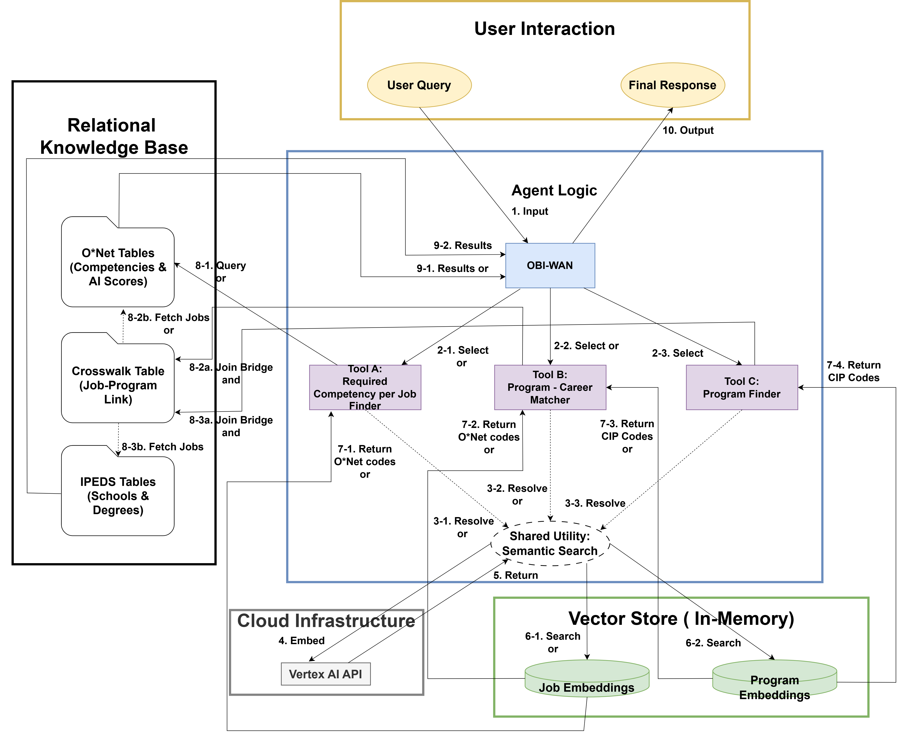

# OBI-WAN: Occupation-Based Index for Workforce AI Navigator

## Demo
A short demo of OBI-WAN is available on LinkedIn. The walkthrough shows how the system moves from an ambiguous career question to grounded skill, program, and institution recommendations through multi-turn clarification and structured retrieval.

## Overview
OBI-WAN is a prototype AI-driven career and education navigator built to support education-to-workforce transitions in higher education. By integrating O*NET, IPEDS, semantic retrieval, and a node-and-edge schema implemented in BigQuery, it delivers explainable career and program guidance grounded in reliable labor and education data. Unlike conventional conversational agents that can hallucinate recommendations, OBI-WAN uses a large language model as a reasoning, dialogue-management, and tool-routing layer over structured relationships among occupations, competencies, programs, and institutions.

## Why It Matters
Education-to-career decisions are increasingly difficult to navigate. Learners often face fragmented information about occupations, skills, degree pathways, and institutions, while generic LLM systems can produce plausible but ungrounded advice. OBI-WAN is designed to support transparent, explainable pathway exploration through human-AI collaboration and structured data grounding. 

## What OBI-WAN Does
- Resolves user goals into standardized occupation and program entities
- Computes a context-adjusted AI applicability score for occupations
- Retrieves aligned competencies, programs, and institutions through SQL joins across node-and-edge tables in BigQuery
- Supports multi-turn preference elicitation for missing parameters
- Produces explanation-driven guidance grounded in structured data rather than free-form model memory

## Example Use Case
User question: “I’m interested in mental health counseling. What skills do I need, and which online master’s programs might fit?”
OBI-WAN response: Maps the query to relevant occupations and programs, retrieves aligned competencies, asks for missing filters such as modality or degree level, and returns grounded institution recommendations from structured O*NET and IPEDS data.

## Quick Start
### Requirements
- Python 3.10+
- Google Cloud project with access to BigQuery and Vertex AI
- Required Python packages listed in `requirements.txt`

### Setup
1. Clone this repository.
2. Install dependencies.
3. Configure Google Cloud authentication.
4. Update environment variables for project ID, region, and table names.
5. Run `notebooks/obiwan_navigator.ipynb` to explore the prototype workflow.

## Data Sources
OBI-WAN currently integrates structured public data sources including:
- **O*NET** for occupations, competencies, and work-relevant attributes
- **IPEDS** for academic programs and institution-level offerings

These sources are used to ground recommendations in structured labor-market and education data rather than free-form model memory.

## Technical Architecture
- **LLM orchestration:** Gemini 2.5 Flash, via Google ADK, manages dialogue, clarification, and tool routing.
- **Semantic retrieval:** Vertex AI (`text-embedding-004`) maps user queries to standardized occupation (SOC) and academic program (CIP) entities using vector similarity.
- **Structured data layer:** BigQuery stores a node-and-edge schema connecting occupations, competencies, academic programs, and institutions.
- **Grounded recommendations:** OBI-WAN retrieves pathway-relevant information through SQL joins across node-and-edge tables, while the LLM formats and explains results rather than inventing domain facts.
- **Stateful interaction:** `ToolContext.state` preserves prior context across turns to support follow-up queries and missing-parameter clarification.

## Retrieval Flow
- User query is embedded with Vertex AI.
- Semantic matching maps the query to SOC/CIP entities.
- BigQuery joins across node-and-edge tables retrieve occupations, competencies, programs, or institutions.
- Gemini formats results, asks clarifying questions when needed, and preserves context across turns.

## Why It Is Different
OBI-WAN combines:
- **Grounded retrieval:** semantic search + SQL joins across node-and-edge tables in BigQuery
- **AI Applicability Score:** an occupation-level signal that helps users gauge how strongly a role may be complemented by AI.
- **Human-AI collaboration:** multi-turn disambiguation and preference elicitation
- **Trust-oriented evaluation framework:** synthetic persona stress-testing for ambiguity, adversarial prompts, and impossible requests

## Potential Applications
OBI-WAN is a proof-of-concept for grounded AI systems that support education-to-workforce decision-making through structured retrieval, transparent reasoning, and human-AI collaboration.
Potential users include:
- Universities and academic advising teams
- Workforce development organizations
- Career navigation platforms
- Edtech and upskilling providers

## Repository Structure
- `README.md` — project overview
- `notebooks/obiwan_navigator.ipynb` — prototype notebook
- `Evaluation/evaluation_synthetic_persona.md` — synthetic persona evaluation framework
- `assets/OBIWAN_System_Architecture03132026.png` — architecture diagram

## Current Status
This repository contains the current prototype and an in-progress evaluation framework. Next steps include expanding the persona-based evaluation harness, analyzing failure patterns systematically, and conducting broader user-centered validation.

## Success Metrics
OBI-WAN is designed to be evaluated not only on technical correctness, but also on decision-support value. At the current stage, these are offline proxy KPIs measured through synthetic persona evaluation:

- **Proxy Pathway Clarification Rate:** % of vague-intent synthetic sessions that end with a narrowed career, program, or degree direction
- **Actionable Recommendation Rate:** % of in-scope synthetic sessions that end with at least one grounded recommendation or clear next step
- **Time to First Actionable Recommendation:** median number of assistant turns required before a grounded, useful recommendation is produced
- **Hallucination-Free Recommendation Rate:** % of synthetic recommendation sessions with no unsupported occupations, programs, or institutions in the final answer

## Evaluation Framework
OBI-WAN includes an in-progress evaluation framework designed to stress-test the agent against ambiguous, adversarial, and non-standard inputs. The current approach uses synthetic personas and edge-case prompts to assess grounding, tool-routing reliability, and resistance to hallucinated career or academic advice.

See [Evaluation/evaluation_synthetic_persona.md](Evaluation/evaluation_synthetic_persona.md) for the current version of framework.

## Limitations
- This repository contains a prototype and research-oriented proof of concept, not a production advising system.
- Current evaluation is based on synthetic persona stress-testing rather than live user studies.
- Recommendations depend on the scope and coverage of the integrated datasets.
- OBI-WAN is intended to support exploration and decision-making, not replace academic advising or professional career counseling.

## Related Research
A research paper describing the design and methodology of OBI-WAN is currently under review. I plan to share more after the conference decision. If you are interested in the project or would like to discuss the work, feel free to reach out by email.

## Contact
- Email: [hdj514@gmail.com](mailto:hdj514@gmail.com)
- LinkedIn: [Damji Stratton](https://www.linkedin.com/in//damji-stratton/?trk=opento_sprofile_details)
