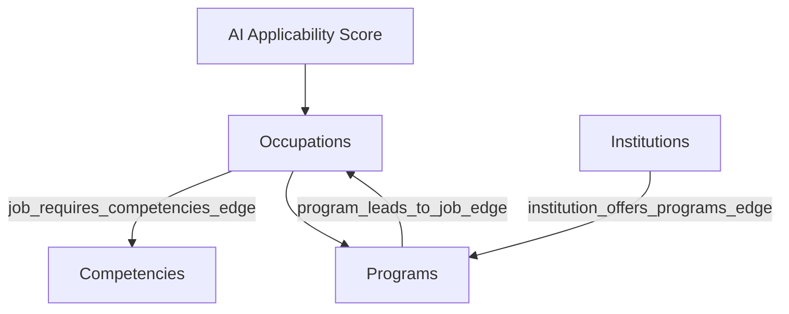

# OBI-WAN Data Model

## Purpose
This document describes the node-and-edge schema implemented in BigQuery for OBI-WAN. The data model connects occupations, competencies, academic programs, and institutions so that career and education recommendations can be grounded in structured O*NET and IPEDS data.

## Relationship Overview

## Core Entities and Relationships

| Table Name | Type | Description |
| :--- | :--- | :--- |
| `onet.occupations_node` | Node | Occupation entities with standardized SOC codes and titles |
| `onet.competencies_node` | Node | Skills, abilities, and knowledge entities |
| `ipeds.programs_node` | Node | Academic programs with CIP codes and titles |
| `ipeds.institutions_node` | Node | Postsecondary institutions |
| `onet.job_requires_competencies_edge` | Edge | Connects occupations to competencies |
| `crosswalk.program_leads_to_job_edge` | Edge | Connects academic programs to occupations |
| `ipeds.institution_offers_programs_edge` | Edge | Connects institutions to academic programs |
| `onet.final_ai_applicability_multiplicative` | Score Table | Stores AI applicability scores for occupations |

## Relationship Logic
The schema is designed around explicit node and edge tables:
- occupations connect to competencies through `job_requires_competencies_edge`
- programs connect to occupations through `program_leads_to_job_edge`
- institutions connect to programs through `institution_offers_programs_edge`

This structure allows OBI-WAN to retrieve grounded multi-step pathways such as:
**occupation → competencies → programs → institutions**

## Retrieval Flow
1. A user query is embedded using Vertex AI.
2. Semantic matching maps the query to standardized SOC or CIP entities.
3. BigQuery joins across node and edge tables retrieve related occupations, competencies, programs, or institutions.
4. Gemini formats the grounded results and asks clarifying questions when required.

## Design Rationale
OBI-WAN uses a node-and-edge schema in BigQuery to make entity relationships explicit and queryable. This allows the agent to generate recommendations from structured data retrieval rather than relying on free-form model memory.
